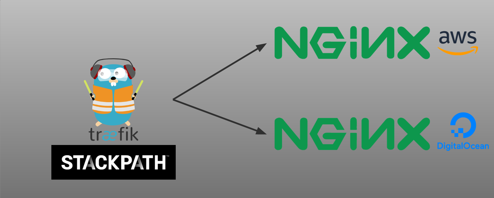
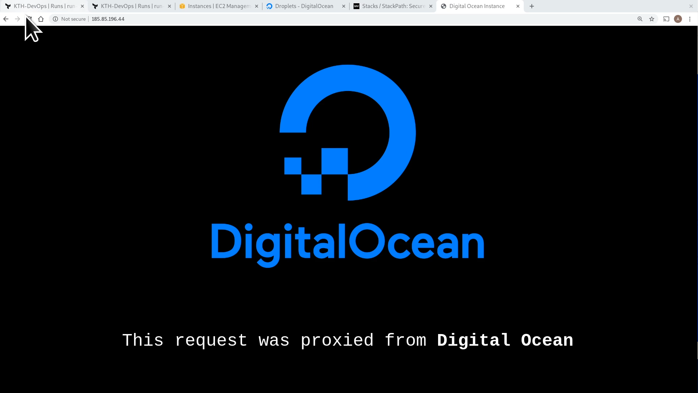
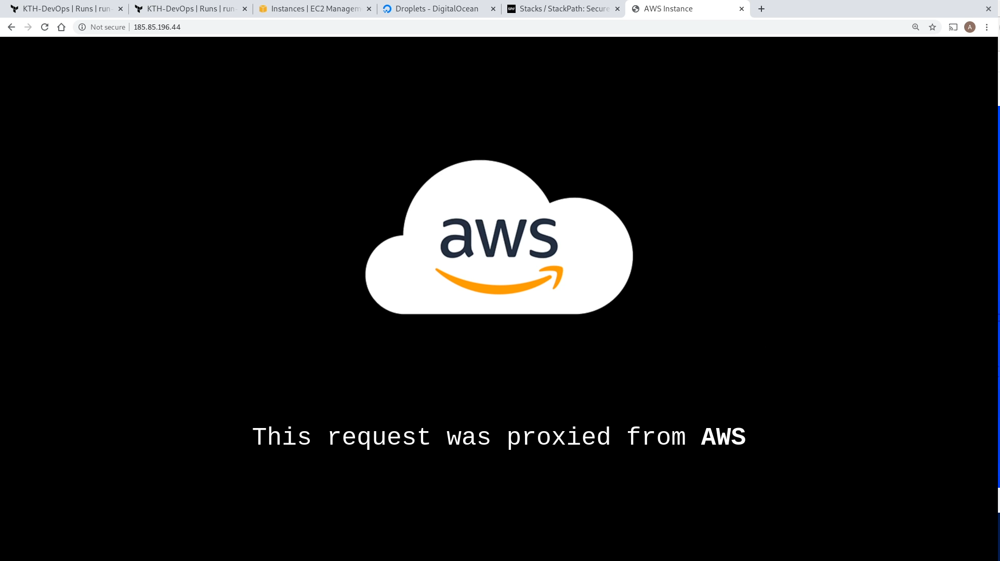

Terraform Cloud Cross Provider Demo
=========
- Link to demo: https://youtu.be/4X-P2ltLJto
- Terraform workspace: https://app.terraform.io/app/KTH-DevOps

# Cross Provider Demo
In this demo we use Terraform Cloud to setup a infrastructure solution that works across multiple cloud providers. A [traefik](https://docs.traefik.io/) load-balancer is setup as a Docker container in [Stackpath](https://www.stackpath.com/). This load-balancer is then connected to a [NGINX](https://www.nginx.com/) web-server running in a [EC2](https://aws.amazon.com/ec2/) instance at [AWS](https://aws.amazon.com/) and another [NGINX](https://www.nginx.com/) web-server running in a [Droplet](https://www.digitalocean.com/docs/droplets/) at [DigitalOcean](https://www.digitalocean.com/).

# Resources
- Terraform Website: https://www.terraform.io
- Terraform Cloud: https://app.terraform.io/app
- Documentation: [https://www.terraform.io/docs/](https://www.terraform.io/docs/)
- Tutorials: [HashiCorp's Learn Platform](https://learn.hashicorp.com/terraform)

